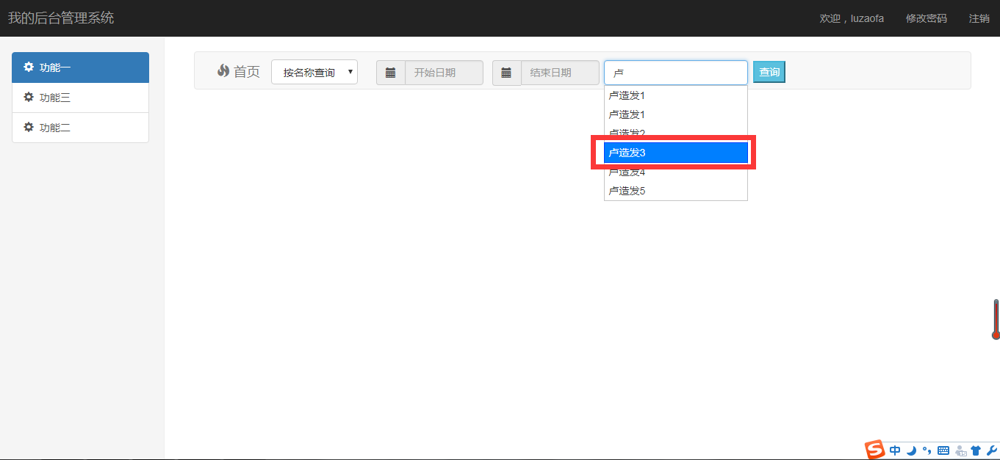
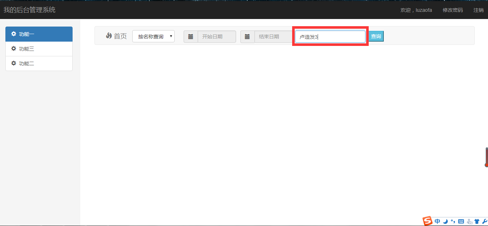

# MyXadminTemplates
Xadmin自定义后台扩展模板（自定义页面、数据表格展示以及翻页功能）

##  1.1：
### 添加输入框联想功能：

##### 输入关键字，下拉显示所有联想数据：

##### 点击下拉显示数据即可选中：

##### 将选中数据填入输入框：

##  1.0：
### 前台数据表格展示以及翻页：

### 后台自定义总模块：

### 自定义模块详情：

### 自定义搜索选择框：

### 搜索数据展示：

